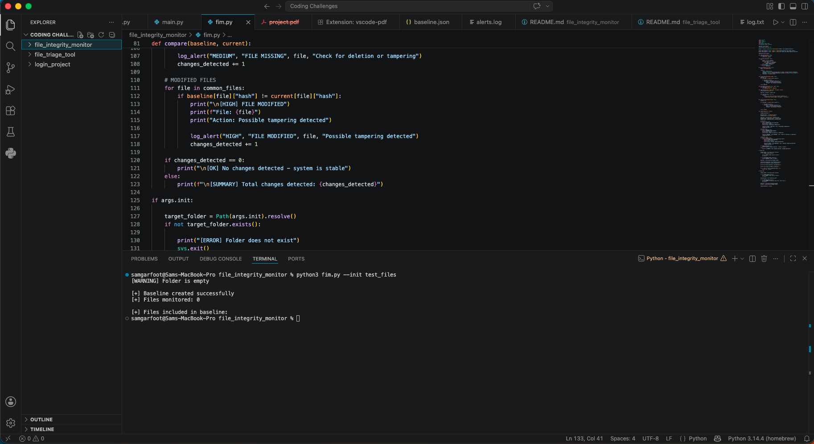
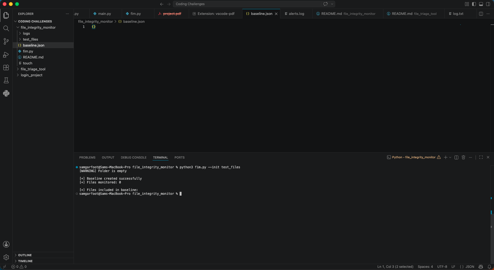
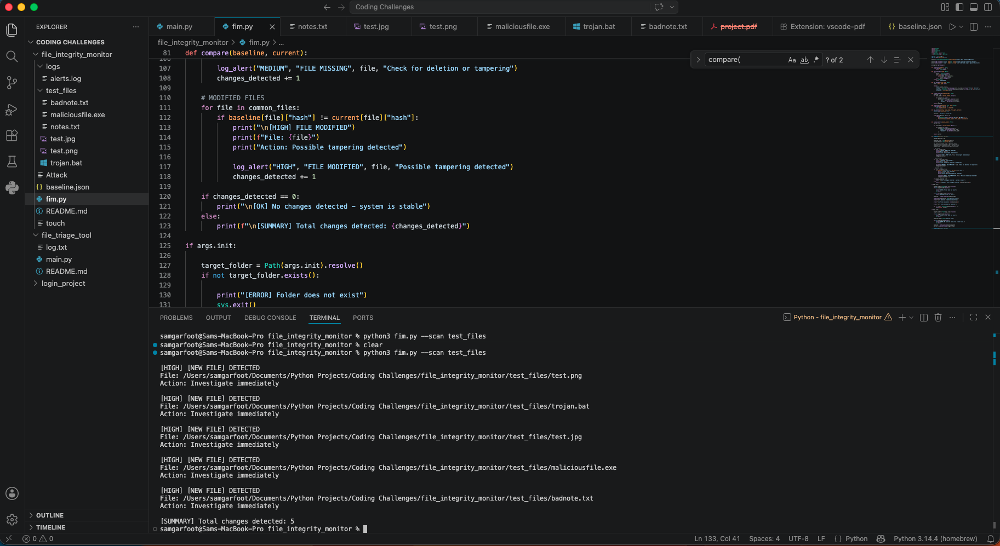
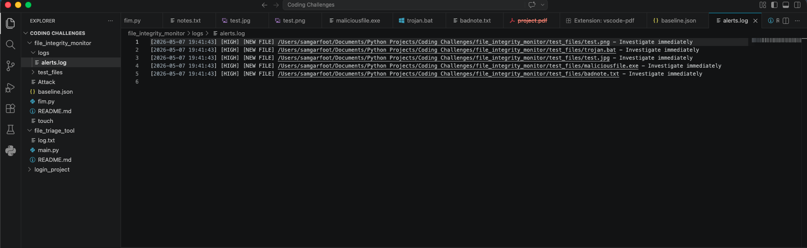

# Steps to Replicate File Integrity Scan

This guide walks through how to run the File Integrity Monitor and reproduce the detection results shown in the screenshots.

---

## Step 1 — Initialise Baseline Scan



Run the initial baseline creation on your target folder:

```
python3 fim.py --init test_files
```

### What happens:
- Scans the target directory
- Generates SHA-256 hashes for files
- Creates baseline.json

In this case, the folder was empty, so 0 files were detected and stored in the baseline.

---

## Step 2 — Baseline File Output



### What this shows:
- The generated baseline.json file
- Confirms successful baseline creation
- No file entries exist due to empty directory

This represents the system’s trusted state snapshot.

---

## Step 3 — Scan for File Changes



Run the scan after adding files:

```
python3 fim.py --scan test_files
```
### What happens:
- Current directory state is scanned
- Compared against baseline
- Differences are detected

In this example:
- 5 NEW FILES were detected
- Each file is flagged with its path and severity level

---

## Step 4 — Log File Output


### What this shows:
All detected events are written to:
- logs/alerts.log
- Logged details include:
- Timestamp
- Event type (NEW FILE / MODIFIED / MISSING)
- File path
- Severity level
- Recommended action

This provides a full audit trail for forensic analysis.

---
