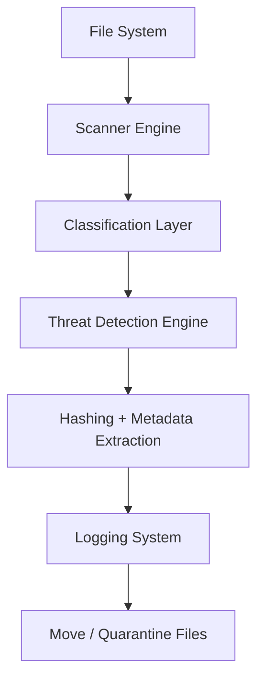

# Architecture

```mermaid
flowchart TD
    A[File System] --> B[Scanner Engine]
    B --> C[Classification Layer]
    C --> D[Threat Detection Engine]
    D --> E[Hashing + Metadata Extraction]
    E --> F[Logging System]
    F --> G[Move / Quarantine Files]
```
