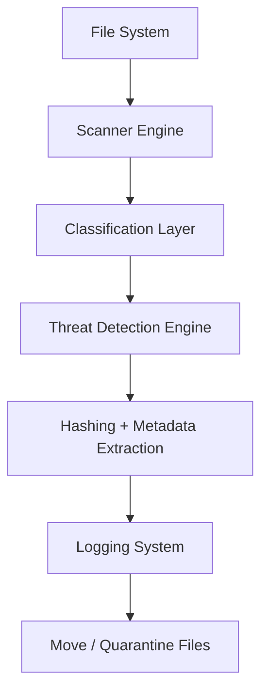

# 📁 File Triage Tool (Python Security Automation)

## 🔐 Overview

The File Triage Tool is a Python-based security automation utility designed to simulate a lightweight endpoint file monitoring and classification system.

It scans directories recursively, classifies files by type, detects potentially suspicious executables, generates SHA-256 hashes for forensic tracking, and quarantines risky files into isolated folders.

This project demonstrates core concepts used in SOC environments, including:
- File system monitoring
- Threat detection logic
- Hash-based file integrity analysis
- Logging and audit trails
- Safe system interaction controls
- Cross-platform file handling (Windows + macOS)

## ⚙️ Features

### 📂 File Processing

Recursive directory scanning

Automatic file classification:
  - Images (.jpg, .png)
  - Documents (.txt)
  - PDFs (.pdf)
  - Other

### ⚠️ Threat Detection

Flags suspicious file types:
 - .exe
 - .bat

Generates SHA-256 hash for forensic tracking

Moves suspicious files into quarantine

### 🧾 Logging System
- Structured event logging (log.txt)
- Tracks:
   - Timestamp
   - File metadata
   - Events (scan, move, quarantine, hash generation)
   - Severity levels

### 🧠 Safety Controls
- Prevents accidental system-wide scans
- Requires confirmation for:
   - Root directories (/)
   - User root (/Users, C:\Users)
   - Admin privilege check for system-level scans (Unix systems)

### 🌍 Cross-Platform Support
Works on:
- macOS
- Linux
- Windows

## Architecture

## 🔐 Security Design Principles
This tool follows simplified SOC-style principles:

1. Least Privilege Awareness - System-level scanning requires explicit confirmation.
2. Auditability - Every action is logged with metadata and timestamps.
3. Isolation - Suspicious files are moved into a quarantine directory.
4. Traceability - SHA-256 hashes allow file verification and forensic comparison.

## 🚀 Future Improvements

### 🧠 Detection Enhancements
- VirusTotal API integration
- File entropy scoring
- Behaviour-based detection rules

### 📊 Analytics Layer
- CSV/JSON export
- Dashboard (Splunk / ELK / Grafana)
