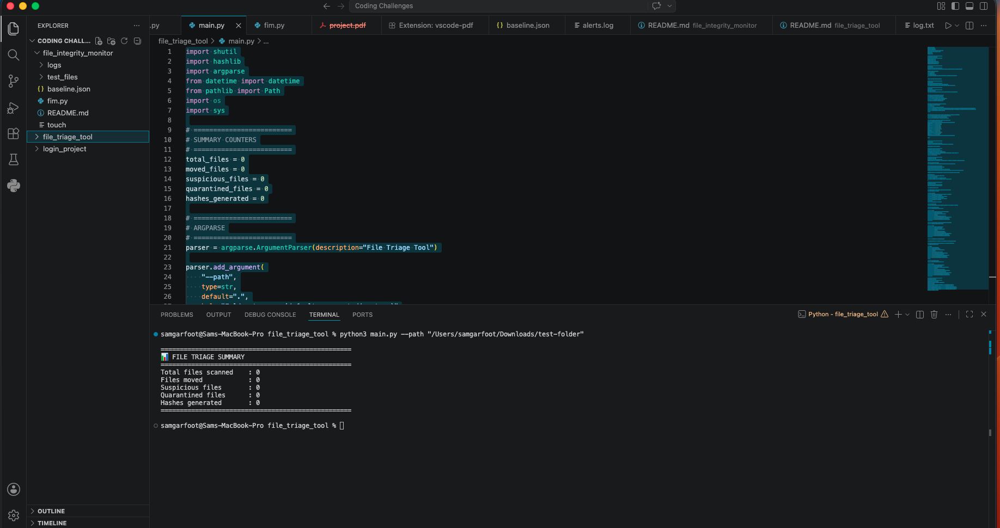
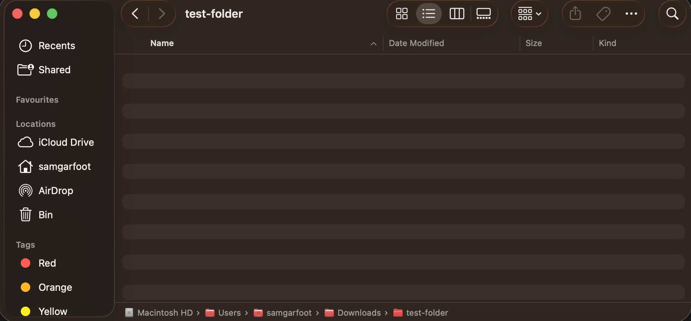
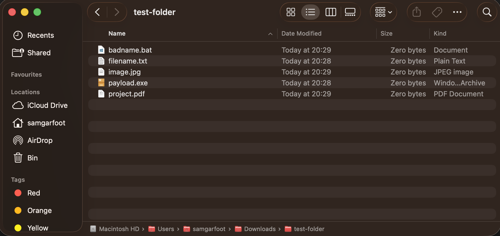
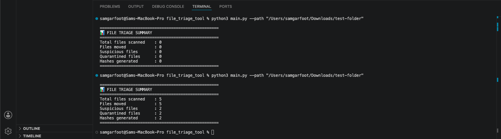
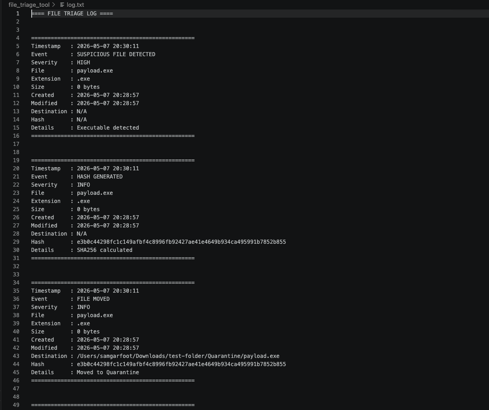
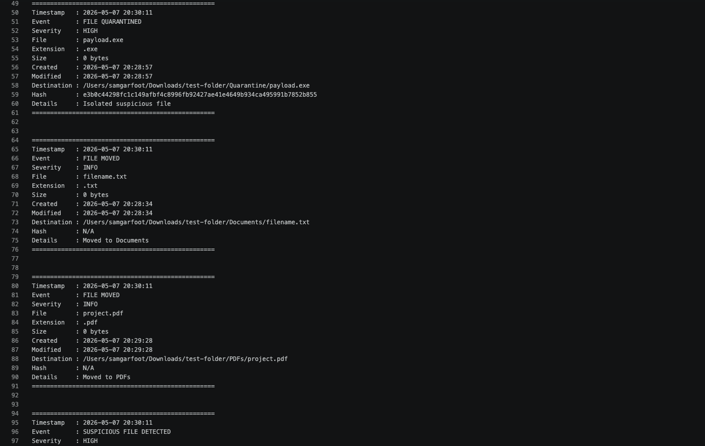
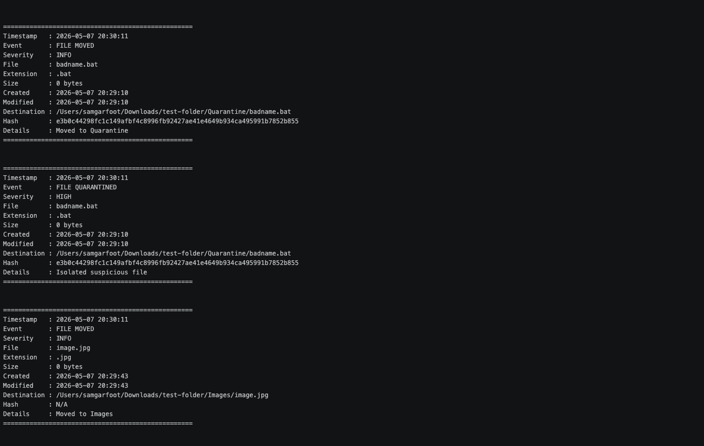
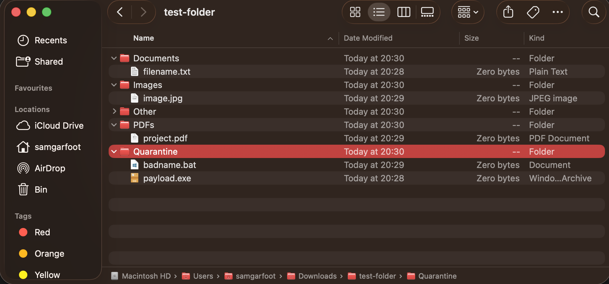

# Steps to replicate

Below is a breakdown of the steps taken to execute the file triage process, supported by reference screenshots.

## Step 1 - Initial file scan

This image shows the initial scan of the 'test-folder' directory, which was created specifically for this demonstration and initially contained no files.

---

## Step 2 - Empty Folder

This screenshot provides confirmation via Finder that the 'test-folder' directory was empty prior to file generation.

---

## Step 3 - File Creation

In this step, a mixed set of test files was created to simulate real-world conditions. These files are intended to be processed and sorted into categorised subfolders by the triage script.

---

## Step 4 - File Detection

After re-running the scan, the script successfully detected 5 new files within 'test-folder'. It correctly identified 2 files as suspicious, generated hashes for them, and moved them into quarantine as defined by the logic.

---

## Step 5 - Logs

---

---

These screenshots display the generated log output, documenting each action performed by the script. This includes file detection, categorisation, movement, and the identification and handling of suspicious files.

---

## Step 6 - Files Assorted

The final image shows the completed file triage structure. All files have been successfully sorted into their respective directories, with suspicious files isolated in the quarantine folder as expected.
